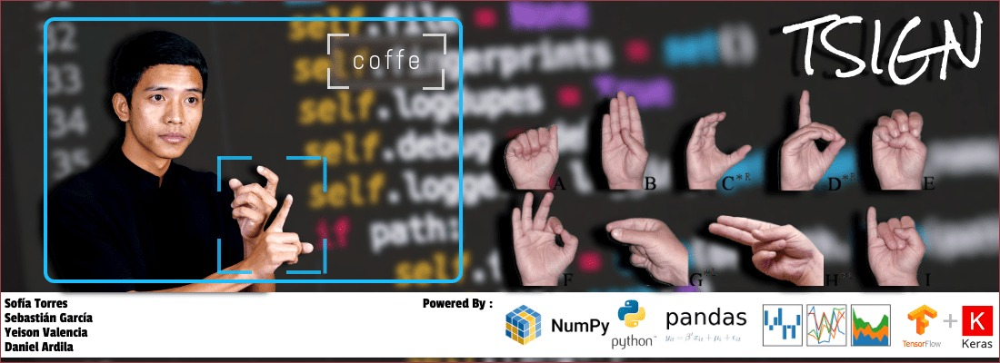

# TSIGN

* ### link vídeo : https://www.youtube.com/watch?v=AGOJ_qRG0Rc 
* ### Diapositivas CV : https://www.canva.com/design/DAD2Miim4sA/pYWPy7DXEthvX7kdLFmzrA/view?utm_content=DAD2Miim4sA&utm_campaign=designshare&utm_medium=link&utm_source=publishsharelink

 

* TSIGN  es una aplicación de reconocimiento de lenguaje de señas americano, que se desarrollo con el objetivo de facilitar este lenguaje a quien lo requiera, de una forma divertida y amigable.
